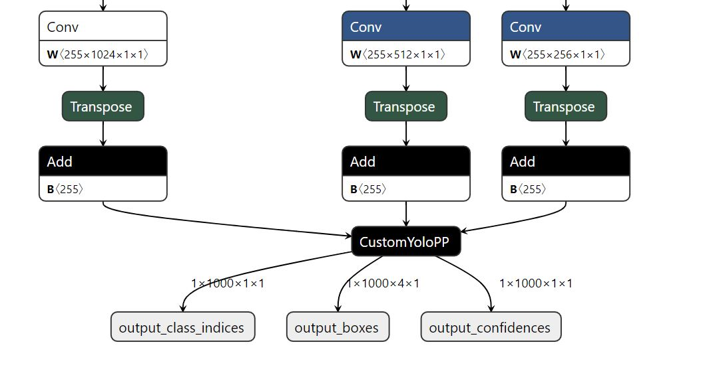

## Intro
Forked from branch https://github.com/ayermolo/darkflow.git
to support YoloV4 pb and onnx file generation from weights.
Take a look of this master branch of [darknet](https://github.com/AlexeyAB/darknet) for YoloV4 Updates. 
More variants of  [YoloV4 weights](https://github.com/AlexeyAB/darknet/wiki/YOLOv4-model-zoo)

## Dependencies

Python3.6.1, tensorflow 1.14, numpy, opencv 3, tf2onnx 1.6 version [branch 1000b66](https://github.com/onnx/tensorflow-onnx/tree/1000b66d66e6332ceaaedde5664de2863a6e30ad)

### Getting started

* Get [yolov4.cfg](https://raw.githubusercontent.com/AlexeyAB/darknet/master/cfg/yolov4.cfg) - 245 MB: [yolov4.weights](https://github.com/AlexeyAB/darknet/releases/download/darknet_yolo_v3_optimal/yolov4.weights) (Google-drive mirror [yolov4.weights](https://drive.google.com/open?id=1cewMfusmPjYWbrnuJRuKhPMwRe_b9PaT) ) paper [Yolo v4](https://arxiv.org/abs/2004.10934)
    just change `width=` and `height=` parameters in `yolov4.cfg` file and use the same `yolov4.weights` file for all cases.
    
* Modify darkflow\darkflow\utils\loader.py
    * Change line 121 self.offset = 16 to self.offset = 20    
* Run python flow --model `path of yolov4.cfg file` --load `path of yolov4 weights` --savepb
    * python36 flow --model `cfg/yolov4.cfg` --load `..\weights\yolov4.weights` --savepb

* Run python -m tf2onnx.convert --input `Frozen pb file` --output `Onnx file name` --inputs `Input node` --outputs `Output nodes` --verbose --opset `Opset number`
    * python36 -m tf2onnx.convert --input `yolov4.pb` --output `yolo_v4.onnx` --inputs `input:0` --outputs `BiasAdd_93:0,BiasAdd_101:0,BiasAdd_109:0` --verbose --opset `10`
    
* Updated ONNX file to have a custom Op for YoloV4 post processing.

  

    
